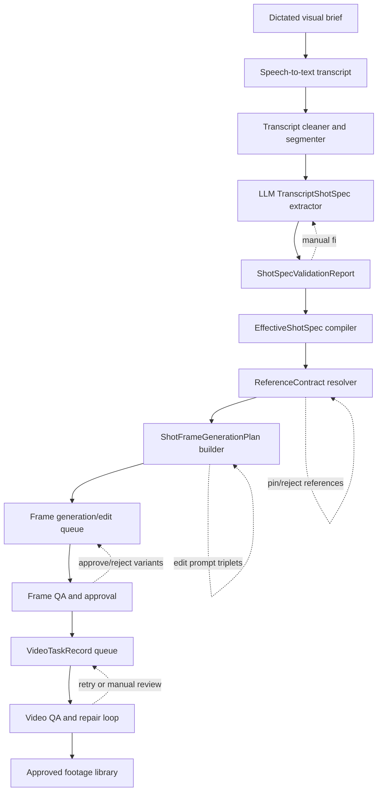

# 01 — North-Star Pipeline

## Executive target

The practical goal is not a single giant prompt sent to a video model. The goal is a local, inspectable production compiler:

```text
dictated/written brief
→ transcript artifact
→ structured shot specs
→ validation and ambiguity report
→ effective shot specs
→ reference contracts
→ shot frame generation plans
→ generated start/end frames
→ video task queue
→ QA/retry/manual review
→ approved footage
```

Every stage should produce a pauseable artifact so the user can manually intervene without losing automation.

## Architecture



## Stage artifacts

| Stage | Artifact | Purpose |
|---|---|---|
| Transcript import | `TranscriptImport` | Raw text, cleaned text, segments, provenance. |
| LLM extraction | `TranscriptShotSpec[]` | Proposed scene/shot descriptions from dictation. |
| Validation | `ShotSpecValidationReport` | Errors, warnings, ambiguities, apply blockers. |
| Compiled shot | `EffectiveShotSpec` | Merged truth from scenes, places, characters, world context, overrides. |
| Reference mesh | `ReferenceContract` | Exact references, roles, scores, reasons, pins/rejections. |
| Frame planning | `ShotFrameGenerationPlan` | Beginning/middle/end or start/end prompts, refs, generate/edit mode. |
| Image output | `GeneratedFrameRecord` | Variant paths, prompt, provider response, sidecars, approval. |
| Video queue | `VideoTaskRecord` | Provider, start/end URLs, prompt, status, output path, attempt. |
| QA | `QAResult` | Pass/fail checks, correction prompt, retry count, manual review flag. |

## Operating modes

| Mode | Behavior |
|---|---|
| Single-shot mode | Work on one shot with full inspectability. |
| Scene mode | Dry-run, plan, generate, and review all shots in one scene. |
| Full-show mode | Dry-run all scenes, report blockers, then queue in controlled batches. |
| Review mode | No paid generation; inspect specs, refs, prompts, QA only. |
| Repair mode | Retry only failed/rejected frames or video tasks. |

## Local project artifact layout

Recommended layout inside the live project:

```text
Metadata/
  automation/
    transcript-imports/
      <run-id>/
        raw-transcript.txt
        cleaned-transcript.txt
        transcript-segments.json
        extracted-shot-specs.json
        validation-report.json

Animate/
  shot-specs/
    <scene-id>/
      <shot-id>.effective-shot-spec.json

  reference-contracts/
    <scene-id>/
      <shot-id>.reference-contract.json

  shot-frame-plans/
    <scene-id>/
      <shot-id>.frame-plan.json

  generated-frames/
    <scene-id>/
      <shot-id>/
        beginning/
          variant-001.png
          prompt.txt
          response.txt
          plan.json
          qa.json
        end/
          variant-001.png
          prompt.txt
          response.txt
          plan.json
          qa.json

  video-tasks/
    <scene-id>/
      <shot-id>/
        vidu-attempt-001.json
        output.mp4
        qa.json
```

## Core design decision

Compile each shot into a compact packet:

```text
world context
+ exact scene/shot facts
+ exact character/place data
+ selected references
+ continuity locks
+ provider-specific prompt contract
```

Do not ask the image/video model to infer the whole opera every time.

## Prompt-construction rule

Every image prompt should explicitly include:

```text
- early-2000s period
- Persian-Afghan highland valley world
- exterior/interior location identity
- architecture/materials
- lighting/time of day
- camera/framing
- character likeness and wardrobe
- physical action
- continuity locks
- negative guardrails
- animated/visual tone
```

Never use the project title as visual shorthand.
