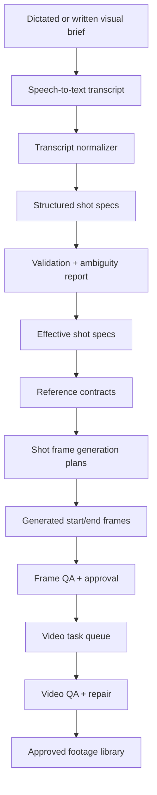
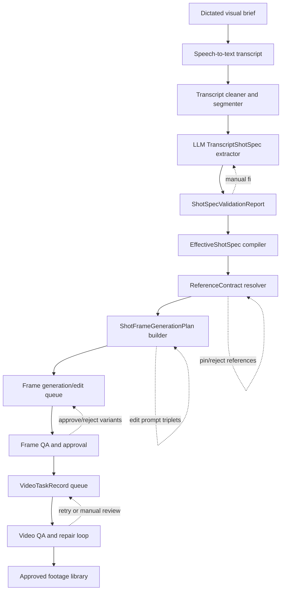

# Amira Automation Strategy — Consolidated Packet


---

# Amira Automation Strategy Packet

Generated: 2026-04-26T18:33:42

## Purpose

This packet turns the Amira prompt-to-animated-footage strategy into repo-ready planning documents and a copy/paste implementation prompt for a coding agent.

The intended outcome is a local-folder-first automation pipeline:



## Contents

| File | Use |
|---|---|
| `01_NORTH_STAR_PIPELINE.md` | Ideal architecture and workflow design. |
| `02_CURRENT_STATE_AND_GAPS.md` | What exists, what is partial, what is missing. |
| `03_DATA_CONTRACTS.md` | JSON/Codable contracts for shot specs, references, frame plans, video tasks, QA. |
| `04_REFERENCE_MESH.md` | Automatic reference selection strategy and drift prevention. |
| `05_SHOT_FRAME_VIDEO_HANDOFF.md` | Generate-vs-edit frame rules, open-matte, Vidu handoff. |
| `06_AUTOMATION_API_CONTRACTS.md` | Loopback endpoints and command contracts for agents. |
| `07_QA_AND_REPAIR.md` | Frame/video QA checks, retry rules, manual escalation. |
| `08_IMPLEMENTATION_ROADMAP_AND_TASKS.md` | Phased roadmap and isolated coding tasks. |
| `09_ACCEPTANCE_TESTS.md` | Minimum test suite and validation checklist. |
| `10_AGENT_IMPLEMENTATION_PROMPT.md` | Long-form copy/paste prompt for the coding agent. |
| `AGENT_PROMPT_SHORT.txt` | Short copy/paste implementation prompt. |
| `IMPLEMENTATION_BACKLOG.json` | Machine-readable task backlog. |

## Non-negotiable rules

1. The app is local-folder-first.
2. Do not design around the deprecated Novotro Project Server.
3. Preserve manual intervention at every stage.
4. Favor dry-run/report-first workflows before paid image/video generation.
5. Never rely on the project title as visual shorthand.
6. Use `Places/places-world-context.json` as canonical for world period.
7. Ignore stale duplicates that describe the world as mid-2020s.
8. Store durable automation artifacts inside the live project.
9. Do not silently overwrite user text, approved references, generated frames, or video outputs.
10. Every paid generation job must produce sidecars and remain resumable.


---

# 01 — North-Star Pipeline

## Executive target

The practical goal is not a single giant prompt sent to a video model. The goal is a local, inspectable production compiler:

```text
dictated/written brief
→ transcript artifact
→ structured shot specs
→ validation and ambiguity report
→ effective shot specs
→ reference contracts
→ shot frame generation plans
→ generated start/end frames
→ video task queue
→ QA/retry/manual review
→ approved footage
```

Every stage should produce a pauseable artifact so the user can manually intervene without losing automation.

## Architecture



## Stage artifacts

| Stage | Artifact | Purpose |
|---|---|---|
| Transcript import | `TranscriptImport` | Raw text, cleaned text, segments, provenance. |
| LLM extraction | `TranscriptShotSpec[]` | Proposed scene/shot descriptions from dictation. |
| Validation | `ShotSpecValidationReport` | Errors, warnings, ambiguities, apply blockers. |
| Compiled shot | `EffectiveShotSpec` | Merged truth from scenes, places, characters, world context, overrides. |
| Reference mesh | `ReferenceContract` | Exact references, roles, scores, reasons, pins/rejections. |
| Frame planning | `ShotFrameGenerationPlan` | Beginning/middle/end or start/end prompts, refs, generate/edit mode. |
| Image output | `GeneratedFrameRecord` | Variant paths, prompt, provider response, sidecars, approval. |
| Video queue | `VideoTaskRecord` | Provider, start/end URLs, prompt, status, output path, attempt. |
| QA | `QAResult` | Pass/fail checks, correction prompt, retry count, manual review flag. |

## Operating modes

| Mode | Behavior |
|---|---|
| Single-shot mode | Work on one shot with full inspectability. |
| Scene mode | Dry-run, plan, generate, and review all shots in one scene. |
| Full-show mode | Dry-run all scenes, report blockers, then queue in controlled batches. |
| Review mode | No paid generation; inspect specs, refs, prompts, QA only. |
| Repair mode | Retry only failed/rejected frames or video tasks. |

## Local project artifact layout

Recommended layout inside the live project:

```text
Metadata/
  automation/
    transcript-imports/
      <run-id>/
        raw-transcript.txt
        cleaned-transcript.txt
        transcript-segments.json
        extracted-shot-specs.json
        validation-report.json

Animate/
  shot-specs/
    <scene-id>/
      <shot-id>.effective-shot-spec.json

  reference-contracts/
    <scene-id>/
      <shot-id>.reference-contract.json

  shot-frame-plans/
    <scene-id>/
      <shot-id>.frame-plan.json

  generated-frames/
    <scene-id>/
      <shot-id>/
        beginning/
          variant-001.png
          prompt.txt
          response.txt
          plan.json
          qa.json
        end/
          variant-001.png
          prompt.txt
          response.txt
          plan.json
          qa.json

  video-tasks/
    <scene-id>/
      <shot-id>/
        vidu-attempt-001.json
        output.mp4
        qa.json
```

## Core design decision

Compile each shot into a compact packet:

```text
world context
+ exact scene/shot facts
+ exact character/place data
+ selected references
+ continuity locks
+ provider-specific prompt contract
```

Do not ask the image/video model to infer the whole opera every time.

## Prompt-construction rule

Every image prompt should explicitly include:

```text
- early-2000s period
- Persian-Afghan highland valley world
- exterior/interior location identity
- architecture/materials
- lighting/time of day
- camera/framing
- character likeness and wardrobe
- physical action
- continuity locks
- negative guardrails
- animated/visual tone
```

Never use the project title as visual shorthand.


---

# 02 — Current State and Gaps

## What already exists and should be trusted

| Area | Current state | Trust level |
|---|---|---|
| Local app shell | `Sources/Opera` opens local project folders and routes modes into Animate. | High |
| Write/script loading | `ScriptStore.swift` loads `.ows`, project folders, characters, scratchpad, history. | High |
| Scene/shot store | `Scenes/scenes.json` is current app-facing scene store. | High |
| Places | `Places/places.json` has 27 deduped places with approved images and prompt fields. | High |
| World context | `Places/places-world-context.json` is canonical; early-2000s world. | High |
| Characters | 6 character rig folders with `rig.json`, references, look-dev fields. | High |
| Animated look | `Settings/animated-look-prompt.json` is global style source. | High |
| Image generation | `GeminiImageService` and `ImagineGenerationService` generate and save sidecars. | Medium-high |
| Vidu client | `ViduAPIService` exists for task creation, polling, download. | Medium |
| Image Intelligence | Discovery, analysis, tags, embeddings, image links, selector exist/recently exist. | Medium |
| Score API | Score playback/export API exists after Score page loads. | Medium |

## Live project counts to validate

Expected live project shape:

```text
Scenes: 52
Shots: 367
Places: 27
Songs: 52 .ows files
Character rig folders with rig.json: 6
Scenes with backgroundID: 51 / 52
Scene backgroundID values mapping to place ID: 51 / 52
Shots with populated shotFrameGeneration: 0
Shots with populated shotBackgroundPlate: 0
```

## Canonical sources

| Domain | Canonical source |
|---|---|
| Song/libretto text | `Songs/*.ows` |
| Scene/shot plan | `Scenes/scenes.json` |
| Places/world model | `Places/places.json` |
| World context | `Places/places-world-context.json` |
| Characters | `Characters/*/rig.json` |
| Animated look | `Settings/animated-look-prompt.json` |
| Reference registry | `Animate/reference-registry.json` and `.md` |

## What is partial

| Area | Partial implementation | Missing completion |
|---|---|---|
| Shot seeding | Existing shots are seeded from script directions and lyric timing. | Rich dictated-shot import and re-run behavior. |
| Shot frame planning | Recent branch describes `ShotFrameGenerationPlan`. | Stable contract, API, queue, UI status. |
| Reference selection | `ImageSearchService.selectForShot` exists/recently exists. | Persisted editable `ReferenceContract`. |
| Open-matte planning | Recent branch direction exists. | Formal sidecar and crop preview. |
| Vidu handoff | `ViduAPIService` exists. | Upload/public URL strategy and wired queue. |
| QA | Image analysis infrastructure exists. | Comparison against shot specs/reference contracts. |
| Manual overrides | UI has prompt editing, refs, thumbnails, dry-runs. | Unified override ledger across stages. |
| APIs | Basic Animate API exists. | Complete loopback command surface. |

## What is missing

1. Formal dictation-to-shot-spec importer.
2. Persisted, editable `ReferenceContract`.
3. Resumable shot-frame generation queue.
4. Complete local-frame-to-video-provider handoff.
5. QA/correction loop for frames and videos.
6. Unified manual override ledger.
7. Cost/dry-run controls across the whole pipeline.
8. Branch cleanup: confirm whether to build from `main` or recent feature branch.

## Weak-area analysis

### Schema gaps

Missing or incomplete:

- `TranscriptImport`
- `TranscriptShotSpec`
- `EffectiveShotSpec`
- `ReferenceContract`
- `ShotFrameGenerationPlan`
- `GeneratedFrameRecord`
- `VideoTaskRecord`
- `QAResult`

### API gaps

The Animate API should let agents run dry-runs, inspect outputs, queue jobs, and resume safely without driving the UI.

Needed first:

```http
GET  /automation/project/summary
GET  /automation/shots/{shotID}/effective-shot-spec
POST /automation/references/resolve
GET  /automation/references/{sceneID}/{shotID}
POST /automation/frame-plans/dry-run
POST /automation/frames/generate
POST /automation/videos/queue
POST /automation/videos/tasks/{taskID}/poll
POST /automation/qa/frame
POST /automation/qa/video
```

### UI gaps

A single Shot Production Inspector should show:

```text
Shot spec
References
Frame plan
Generated frame variants
Approvals
Video task
QA results
Retry/manual-review state
```

### Metadata gaps

Save these now:

| Artifact | Must save |
|---|---|
| Transcript import | raw text, cleaned text, segment IDs, source timestamps if available |
| Shot spec | LLM output, validation status, manual edits, original excerpt |
| Reference contract | selected refs, rejected refs, scores, reasons, roles, resolver version |
| Frame plan | prompt text, provider, refs, generate/edit mode, source image, crop plan |
| Generated image | prompt, response, seed/settings if available, refs, cost estimate, QA result |
| Video task | provider, model, URLs, local paths, status, duration, prompt, output path |
| QA | checks, pass/fail, correction suggestion, retry attempt |

### Risk areas

| Risk | Mitigation |
|---|---|
| Wrong place drift | Require place ID + approved place image + geography anchors. |
| Wrong character drift | Require exact slug + identity/costume references. |
| Wrong world period | Inject canonical early-2000s world context. |
| Wrong bridge/map geography | Require map refs for outdoor geography and bridge refs for bridge shots. |
| Style drift | Always include animated look prompt/style constraints. |
| Silent paid mistakes | Dry-run first; cost caps; explicit execute mode. |
| Lost manual decisions | Persist pins, rejections, approvals, overrides. |
| Stale branch assumptions | Confirm and normalize implementation branch before coding. |


---

# 03 — Data Contracts

All contracts should be versioned and Codable. Unknown optional fields should not crash decoding. Required identity fields should fail validation when missing.

## `TranscriptImport`

```json
{
  "version": 1,
  "runID": "UUID",
  "createdAt": "ISO-8601",
  "source": {
    "kind": "speech_to_text | pasted_text | file",
    "path": "optional local path",
    "language": "en",
    "durationSeconds": null
  },
  "rawTranscriptPath": "Metadata/automation/transcript-imports/<run>/raw-transcript.txt",
  "cleanedTranscriptPath": "Metadata/automation/transcript-imports/<run>/cleaned-transcript.txt",
  "segments": [
    {
      "segmentID": "seg-001",
      "startOffsetSeconds": null,
      "endOffsetSeconds": null,
      "text": "The convoy enters the valley at dawn..."
    }
  ]
}
```

## `TranscriptShotSpec`

Minimum useful LLM output from dictated text:

```json
{
  "version": 1,
  "runID": "UUID",
  "sceneKey": "Songs/1.01.0 - Overture.ows",
  "shotKey": "overture-valley-choke-points-establish",
  "proposedShotID": "optional UUID",
  "shotName": "Valley choke points establish",
  "sourceTextExcerpt": "A single road cuts through the valley floor...",
  "charactersPresent": [],
  "focusCharacterSlug": null,
  "place": {
    "kind": "known_place | proposed_new_place | ambiguous",
    "placeID": "990DFFC1-FEA5-59F5-A3BC-212DEF39734A",
    "placeName": "Mountain Valley Approach Road",
    "confidence": 0.94
  },
  "timeOfDay": {
    "value": "dawn",
    "confidence": 0.88,
    "source": "explicit"
  },
  "camera": {
    "cameraShot": "extreme_wide",
    "cameraMovement": "slow_track_forward",
    "lensFamily": "medium telephoto or grounded documentary",
    "screenDirection": "convoy moves upstream/right-to-left if established"
  },
  "shotIntent": "establishing",
  "visualAction": "The convoy follows the dusty road along the river as peaks catch first light.",
  "startFrameDescription": "Wide dawn view of valley road, river low below, bridge and village legible.",
  "endFrameDescription": "Convoy has advanced farther along the road toward the ridge approach.",
  "continuityLocks": [
    "early-2000s period",
    "river low in valley",
    "village on north bank only",
    "old stone bridge as only crossing",
    "small temporary ridge base"
  ],
  "referenceNeeds": [
    "location_identity",
    "spatial_map",
    "style"
  ],
  "ambiguities": [],
  "manualOverrideHints": []
}
```

## `EffectiveShotSpec`

Compiled truth used for reference resolution and prompt planning:

```json
{
  "version": 1,
  "sceneID": "scene UUID or stable scene key",
  "shotID": "AnimationSceneShot UUID",
  "owsSongPath": "Songs/1.01.0 - Overture.ows",
  "shotName": "Valley choke points establish",
  "source": {
    "kind": "existing_scene_shot | transcript_import | merged",
    "sourceLineNumber": 7,
    "sourceLyricExcerpt": "A single road cuts through the valley floor...",
    "sourceTextExcerpt": "..."
  },
  "place": {
    "placeID": "990DFFC1-FEA5-59F5-A3BC-212DEF39734A",
    "placeName": "Mountain Valley Approach Road",
    "locationCategory": "Exterior",
    "approvedImagePath": "Animate/backgrounds/places/...",
    "canonicalWorldContextPath": "Places/places-world-context.json"
  },
  "characters": [
    {
      "slug": "johnny-ward",
      "id": "9012E260-9F82-4C5D-895D-0775F76BB807",
      "roleInShot": "focus | present | background",
      "wardrobeType": "soldier"
    }
  ],
  "camera": {
    "cameraShot": "wide",
    "cameraMovement": "hold",
    "shotIntent": "movement"
  },
  "visualAction": "What physically changes during the shot.",
  "startFrameDescription": "Opening visible state.",
  "endFrameDescription": "Closing visible state.",
  "worldContinuity": {
    "timePeriod": "Early 2000s",
    "regionalWorld": "Persian-Afghan highland valley",
    "technologyGuardrails": "No future technology; sparse early-mobile-era details only"
  },
  "continuityLocks": [
    "character likeness",
    "wardrobe",
    "place geography",
    "lighting",
    "screen direction"
  ],
  "manualOverrides": [],
  "validation": {
    "status": "valid | blocked | needs_review",
    "errors": [],
    "warnings": []
  }
}
```

## `ReferenceContract`

```json
{
  "version": 1,
  "sceneID": "...",
  "shotID": "...",
  "resolverVersion": "reference-contract-resolver-1",
  "createdAt": "ISO-8601",
  "effectiveShotSpecHash": "sha256",
  "maxReferenceCount": 8,
  "requiredRoles": [
    "location_identity",
    "spatial_map",
    "character_identity",
    "character_costume",
    "style"
  ],
  "selectedReferences": [
    {
      "referenceID": "ref-001",
      "path": "/absolute/path/to/image.png",
      "relativePath": "Animate/backgrounds/...",
      "role": "location_identity",
      "ownerType": "place",
      "ownerID": "990DFFC1-FEA5-59F5-A3BC-212DEF39734A",
      "score": 1.0,
      "reason": "Approved image for scene backgroundID",
      "pinned": false,
      "excluded": false,
      "source": "place.approvedImagePath"
    }
  ],
  "rejectedReferences": [
    {
      "path": "/absolute/bad-ref.png",
      "reason": "Wrong bridge angle"
    }
  ],
  "missingRoles": [],
  "conflicts": [],
  "manualOverrides": []
}
```

## `ShotFrameGenerationPlan`

```json
{
  "version": 1,
  "sceneID": "...",
  "shotID": "...",
  "effectiveShotSpecPath": "Animate/shot-specs/<scene>/<shot>.json",
  "referenceContractPath": "Animate/reference-contracts/<scene>/<shot>.json",
  "moments": [
    {
      "moment": "beginning",
      "mode": "generate",
      "sourceImagePath": null,
      "prompt": {
        "positive": "A grounded early-2000s Persian-Afghan highland valley...",
        "negative": "No modern city, no drones, no glossy CGI...",
        "motionIntent": "Convoy begins entering the frame along the road."
      },
      "referenceIDs": ["ref-001", "ref-002"],
      "approvalRequired": true
    },
    {
      "moment": "end",
      "mode": "edit",
      "sourceImagePath": "Animate/generated-frames/.../beginning/variant-001.png",
      "prompt": {
        "positive": "Keep the same valley geography and convoy identity, advance the convoy...",
        "negative": "Do not change bridge placement or village side of river.",
        "motionIntent": "Convoy has moved farther along the same road."
      },
      "referenceIDs": ["ref-001", "ref-002"],
      "approvalRequired": true
    }
  ],
  "openMatte": {
    "enabled": true,
    "generatedAspectRatio": "4:3",
    "targetAspectRatio": "16:9",
    "cropMotion": "hold"
  },
  "costEstimate": {
    "imageJobs": 2,
    "videoJobs": 0
  },
  "status": "dry_run | ready | generating | complete | blocked"
}
```

## `GeneratedFrameRecord`

```json
{
  "version": 1,
  "sceneID": "...",
  "shotID": "...",
  "moment": "beginning | middle | end",
  "variantID": "variant-001",
  "provider": "gemini_vertex",
  "mode": "generate | edit",
  "sourceImagePath": null,
  "outputImagePath": "Animate/generated-frames/<scene>/<shot>/beginning/variant-001.png",
  "promptPath": "prompt.txt",
  "responsePath": "response.txt",
  "planPath": "plan.json",
  "referenceContractPath": "Animate/reference-contracts/<scene>/<shot>.reference-contract.json",
  "approved": false,
  "approvedAt": null,
  "qaPath": null,
  "status": "queued | generating | succeeded | failed | approved | rejected"
}
```

## `VideoTaskRecord`

```json
{
  "version": 1,
  "shotID": "...",
  "sceneID": "...",
  "provider": "vidu",
  "providerModel": "vidu2.0",
  "startFramePath": "/absolute/start.png",
  "endFramePath": "/absolute/end.png",
  "startFramePublicURL": "https://...",
  "endFramePublicURL": "https://...",
  "motionPrompt": "clear physical motion between start and end",
  "durationSeconds": 4,
  "resolution": "1080p",
  "movementAmplitude": "auto",
  "taskID": "provider-task-id",
  "status": "queued | generating | succeeded | failed",
  "outputPath": "/absolute/output.mp4",
  "qaStatus": "untested | pass | fail | needs_review",
  "attempt": 1
}
```

## `QAResult`

```json
{
  "version": 1,
  "sceneID": "...",
  "shotID": "...",
  "artifactKind": "frame | video",
  "artifactPath": "/absolute/path",
  "status": "pass | fail | needs_review",
  "checks": [
    {
      "name": "place_identity",
      "status": "pass | fail | warning",
      "evidence": "The old stone bridge and north-bank village are visible.",
      "correctionHint": null
    }
  ],
  "retryRecommendation": {
    "action": "accept | regenerate | edit | manual_review",
    "reason": "Wrong place geography.",
    "correctionPrompt": "Keep the approved valley map and bridge placement..."
  },
  "attempt": 1,
  "createdAt": "ISO-8601"
}
```

## Validation rules

1. Every shot must resolve to exactly one known place or one explicit `new_place_candidate`.
2. Character slugs must match `Characters/*/rig.json` or become `new_character_candidate`.
3. A shot cannot queue video until approved start/end frames exist.
4. A known place/character shot cannot use a generic prompt without references.
5. New geography must not be silently mapped to a nearby existing place.
6. Storyboard/manual anchors outrank LLM text.
7. Manual pinned refs must survive resolver re-runs.
8. Rejected refs must not be auto-selected again.
9. World period must come from `Places/places-world-context.json`.
10. Prompts must spell out world, period, materials, lighting, and tone.


---

# 04 — Reference Mesh

## Purpose

The reference mesh should choose the right images for a shot automatically while preventing wrong-location, wrong-character, wrong-period, and wrong-style drift.

The resolver should produce a durable `ReferenceContract`, not just a list of images.

## Reference roles

| Role | Required when | Typical source |
|---|---|---|
| `location_identity` | Every known place shot | Place approved image |
| `spatial_map` | Outdoor/geography shots | Hand-curated map reference |
| `landmark_design` | Bridge/landmark shots | Registry bridge refs |
| `character_identity` | Character visible/focus | Master sheet/profile/head turnaround |
| `character_costume` | Character visible | Costume reference sets |
| `storyboard_layout` | Storyboard exists | iPad/storyboard frame |
| `shot_continuity` | Same scene/adjacent shot exists | Approved prior generated frames |
| `style` | Always, unless prompt-only style is enough | Animated look prompt/style refs |
| `manual_pinned` | User pins anything | Manual override |

## Resolver priority order

1. Manual pinned references.
2. Same-shot storyboard/layout references.
3. Same-shot approved generated frames.
4. Exact character/place references by ID.
5. Hand-curated registry references: map, bridge, costume.
6. Same scene/place/character approved/generated references.
7. Spatial character annotations.
8. Tag/metadata query matches.
9. Embedding similarity.
10. Style fallback references.

## Reference quotas

Do not let one category crowd out required identity anchors.

### Character-focus exterior shot

Max 8 refs:

| Slot | Role |
|---|---|
| 1 | Manual pinned, if any |
| 2 | Character identity/master sheet |
| 3 | Character head/expression or costume |
| 4 | Place approved image |
| 5 | Map reference |
| 6 | Landmark ref, if relevant |
| 7 | Storyboard or prior shot frame |
| 8 | Style/animated look or extra continuity ref |

### Place-only establishing shot

Max 8 refs:

| Slot | Role |
|---|---|
| 1 | Manual pinned, if any |
| 2 | Place approved image |
| 3 | Map reference |
| 4 | Landmark ref, if relevant |
| 5 | Same-place generated image |
| 6 | Storyboard/layout |
| 7 | Style ref |
| 8 | Optional adjacent-shot continuity ref |

### Interior character dialogue shot

Max 8 refs:

| Slot | Role |
|---|---|
| 1 | Manual pinned |
| 2 | Character A identity |
| 3 | Character A costume/head |
| 4 | Character B identity, if present |
| 5 | Character B costume/head |
| 6 | Interior place approved image |
| 7 | Storyboard/layout |
| 8 | Style ref |

## Drift prevention

| Drift risk | Prevention |
|---|---|
| Wrong character | Require exact slug match and character identity ref. |
| Wrong wardrobe | Include costume ref and wardrobe text. |
| Wrong place | Require known `placeID`; include approved place image. |
| Wrong geography | Add map ref for outdoor shots. |
| Wrong bridge | Add bridge design refs for bridge scenes. |
| Wrong time period | Inject canonical early-2000s world context. |
| Wrong style | Inject `Settings/animated-look-prompt.json`. |
| Wrong angle | Use storyboard/layout and prior approved frames. |
| Repeated bad refs | Persist rejection memory. |

## Outdoor/geography rule

Use map refs for:

- establishing shots
- bridge shots
- ridge/base shots
- market/village exterior shots
- shots where river/bridge/base/village relationships are visible
- any shot with geography continuity constraints

## Character rule

For character shots, use at least:

```text
character identity ref
+ costume/wardrobe ref
+ place ref
+ style/world context
```

For close-ups, prioritize face/head/expression. For wide shots, prioritize costume silhouette and place geography.

## Manual overrides

Manual overrides must be first-class data, not temporary UI choices.

Persist:

```json
{
  "pinnedReferences": [
    {
      "path": "/absolute/path.png",
      "role": "manual_pinned",
      "reason": "User wants this exact angle."
    }
  ],
  "rejectedReferences": [
    {
      "path": "/absolute/bad.png",
      "reason": "Wrong bridge profile."
    }
  ],
  "roleOverrides": [
    {
      "role": "spatial_map",
      "required": true
    }
  ]
}
```

## Conflict detection

Examples:

| Conflict | Report |
|---|---|
| Reference is day, shot says night | Warning: lighting mismatch. |
| Reference owner place differs from shot place | Block unless manually pinned. |
| Character ref slug differs from focus character | Block unless explicitly allowed. |
| Bridge ref selected for non-bridge interior | Warning or demote. |
| Storyboard says close-up, shot spec says wide | Needs review. |


---

# 05 — Shot Frame and Video Handoff

## Internal frame model

Keep `beginning / middle / end` internally, but expose `start / end` to video generation.

```text
beginning = video start frame
middle    = optional continuity / QA / split frame
end       = video end frame
```

Reasons:

- Video generators usually want start/end.
- Middle frames improve continuity, QA, and edit-mode planning.
- Longer shots can be split into multiple start/end video tasks.
- Middle can become either a QA checkpoint or split point.

## Generate vs edit rules

| Condition | Mode |
|---|---|
| First frame of shot | Usually fresh `generate` |
| Same place, same angle, same characters | `edit` from previous approved frame |
| End frame with same composition | `edit` from beginning or middle |
| Character expression/action change only | `edit` |
| Camera hard cut | fresh `generate` |
| New place | fresh `generate` |
| Major time jump | fresh `generate` |
| New character enters but composition same | edit if source can support it; otherwise generate |
| Storyboard frame exists | use storyboard as layout authority |
| No readable source image for edit | fail visibly; do not silently degrade |

## Open-matte strategy

Use open-matte generation to gain camera control:

1. Generate a wider/taller plate, e.g. 4:3.
2. Extract 16:9 frames for video.
3. Preserve 21:9 delivery headroom.
4. Simulate pans/tilts/zooms through deterministic crop keyframes.
5. Store crop rectangles in the plan sidecar.

Example:

```json
{
  "version": 1,
  "generatedAspectRatio": "4:3",
  "generatedImageSize": "4K",
  "extractionTargetAspectRatio": "16:9",
  "finalDeliveryAspectRatio": "21:9",
  "intendedCameraShot": "medium",
  "generatedCameraShot": "wide",
  "cropMotion": "pan_right",
  "cropKeyframes": [
    {
      "moment": "beginning",
      "cropRect": { "x": 0.08, "y": 0.18, "width": 0.84, "height": 0.63 }
    },
    {
      "moment": "end",
      "cropRect": { "x": 0.12, "y": 0.18, "width": 0.84, "height": 0.63 }
    }
  ]
}
```

## Frame generation sidecars

Every paid frame job must write:

```text
image file
prompt.txt
response.txt
plan.json
reference-contract.json or pointer
qa.json when QA runs
approval metadata
```

## Video handoff

A video task should not queue until:

```text
- start/beginning frame exists
- end frame exists
- both are approved or explicitly auto-approved
- public URLs are available or upload service succeeds
- motion prompt exists
- cost cap allows the task
```

## Provider upload abstraction

Add a protocol:

```swift
protocol FrameUploadService {
    func uploadFrame(localPath: URL) async throws -> URL
}
```

Use this to support Vidu or future providers without hard-coding one upload path.

## Video duration policy

| Shot type | Video strategy |
|---|---|
| Simple action/reaction | 4s start/end task |
| Dialogue beat | 4s or 8s task |
| Longer movement | Split into multiple 4s/8s tasks |
| Major camera move | Prefer open-matte crop or split shots |
| Complex geography/action | Generate middle frame and split |

Do not push long, complex shots into a single video generation unless start/middle/end have been approved.

## Video task record

```json
{
  "version": 1,
  "shotID": "...",
  "sceneID": "...",
  "provider": "vidu",
  "providerModel": "vidu2.0",
  "startFramePath": "/absolute/start.png",
  "endFramePath": "/absolute/end.png",
  "startFramePublicURL": "https://...",
  "endFramePublicURL": "https://...",
  "motionPrompt": "clear physical motion between start and end",
  "durationSeconds": 4,
  "resolution": "1080p",
  "movementAmplitude": "auto",
  "taskID": "provider-task-id",
  "status": "queued | generating | succeeded | failed",
  "outputPath": "/absolute/output.mp4",
  "qaStatus": "untested | pass | fail | needs_review",
  "attempt": 1
}
```

## Resume behavior

- Store task records before calling provider APIs.
- After app restart, scan `Animate/video-tasks`.
- Resume polling tasks with `queued` or `generating`.
- Failed tasks remain inspectable and retryable.
- Retried tasks increment `attempt` and preserve previous records.


---

# 06 — Automation API Contracts

## API principles

1. All APIs operate on local project paths.
2. Dry-run endpoints come before paid endpoints.
3. Mutating endpoints write sidecars.
4. Every endpoint returns a report with blockers.
5. Paid generation endpoints require explicit `mode: "execute"`.
6. Queues are resumable.
7. No endpoint silently overwrites user-approved assets.

Base port:

```text
Animate API: localhost:19849
```

## Health and project

```http
GET /health
GET /automation/project/summary
```

Expected `project/summary` fields:

```json
{
  "projectPath": "/Volumes/Storage VIII/Users/gary/Amira - A Modern Opera",
  "sceneCount": 52,
  "shotCount": 367,
  "placeCount": 27,
  "characterRigCount": 6,
  "canonicalWorldContextPath": "Places/places-world-context.json",
  "warnings": []
}
```

## Effective shot specs

```http
GET /automation/scenes/{sceneID}/effective-shot-specs
GET /automation/shots/{shotID}/effective-shot-spec
```

Response:

```json
{
  "status": "ok",
  "effectiveShotSpec": {},
  "validation": {
    "status": "valid | blocked | needs_review",
    "errors": [],
    "warnings": []
  }
}
```

## Transcript import

```http
POST /automation/transcripts/import/dry-run
POST /automation/transcripts/{runID}/apply
```

Dry-run request:

```json
{
  "projectPath": "/Volumes/Storage VIII/Users/gary/Amira - A Modern Opera",
  "text": "Long dictated transcript...",
  "targetSceneKey": null,
  "llmProvider": "manual_or_external",
  "mode": "dry_run"
}
```

## Reference contracts

```http
POST /automation/references/resolve
GET /automation/references/{sceneID}/{shotID}
POST /automation/references/{sceneID}/{shotID}/pin
POST /automation/references/{sceneID}/{shotID}/reject
POST /automation/references/{sceneID}/{shotID}/rerun
```

Resolve request:

```json
{
  "sceneID": "...",
  "shotID": "...",
  "maxImages": 8,
  "mode": "dry_run | save",
  "includeEmbeddings": true,
  "respectManualOverrides": true
}
```

Pin request:

```json
{
  "path": "/absolute/path.png",
  "role": "manual_pinned",
  "reason": "User chose this as the correct angle."
}
```

Reject request:

```json
{
  "path": "/absolute/path.png",
  "reason": "Wrong location or wrong character."
}
```

## Frame plans

```http
POST /automation/frame-plans/dry-run
GET /automation/frame-plans/{sceneID}/{shotID}
POST /automation/frame-plans/{sceneID}/{shotID}/approve
```

Dry-run request:

```json
{
  "sceneID": "...",
  "shotIDs": ["optional shot subset"],
  "includeReferences": true,
  "includeCostEstimate": true,
  "mode": "dry_run"
}
```

## Frame generation

```http
POST /automation/frames/generate
GET /automation/frames/jobs/{jobID}
POST /automation/frames/jobs/{jobID}/cancel
POST /automation/frames/{sceneID}/{shotID}/approve-variant
```

Generate request:

```json
{
  "sceneID": "...",
  "shotID": "...",
  "moments": ["beginning", "end"],
  "provider": "gemini_vertex",
  "variantCount": 2,
  "mode": "execute",
  "costCap": {
    "maxImageJobs": 2
  }
}
```

## Video tasks

```http
POST /automation/videos/queue
GET /automation/videos/tasks/{taskID}
POST /automation/videos/tasks/{taskID}/poll
POST /automation/videos/tasks/{taskID}/download
POST /automation/videos/tasks/{taskID}/retry
```

Queue request:

```json
{
  "sceneID": "...",
  "shotID": "...",
  "provider": "vidu",
  "durationSeconds": 4,
  "resolution": "1080p",
  "movementAmplitude": "auto",
  "mode": "execute"
}
```

## QA

```http
POST /automation/qa/frame
POST /automation/qa/video
GET /automation/qa/{sceneID}/{shotID}
POST /automation/qa/{sceneID}/{shotID}/accept
POST /automation/qa/{sceneID}/{shotID}/mark-needs-review
```

Frame QA request:

```json
{
  "sceneID": "...",
  "shotID": "...",
  "framePath": "/absolute/path.png",
  "moment": "beginning",
  "mode": "execute"
}
```

Video QA request:

```json
{
  "sceneID": "...",
  "shotID": "...",
  "videoPath": "/absolute/path.mp4",
  "mode": "execute"
}
```

## Error states

Use explicit states instead of silent failures:

```text
blocked_missing_place
blocked_missing_character
blocked_missing_reference_role
blocked_missing_edit_source
blocked_unapproved_start_frame
blocked_unapproved_end_frame
blocked_upload_failed
blocked_cost_cap
failed_provider_error
failed_qa
needs_manual_review
```

## Agent-safe workflow

Recommended command sequence for coding agents:

```text
1. GET /automation/project/summary
2. GET /automation/scenes/{sceneID}/effective-shot-specs
3. POST /automation/references/resolve with dry_run
4. POST /automation/frame-plans/dry-run
5. Save contract/plan only after dry-run passes
6. Generate one beginning frame only
7. Approve variant manually or via explicit test fixture
8. Generate end frame
9. Queue video only after both frames are approved
10. Run QA
```


---

# 07 — QA and Repair

## Principle

QA should compare generated outputs against the shot spec and reference contract, not just ask whether an image looks good.

## Frame QA checks

| Check | Example failure |
|---|---|
| Place identity | Ridge shelf becomes permanent concrete base. |
| Character identity | Johnny face drifts into Luke. |
| Wardrobe | Soldier loses desert camouflage/field gear. |
| Time period | Modern smartphones, drones, LED screens. |
| Geography | Village appears on wrong side of river. |
| Landmark | Bridge disappears or becomes modern steel. |
| Camera | Close-up generated when shot requires wide geography. |
| Action | End frame does not reflect described change. |
| Style | CGI smoothness, HDR punch, wrong animation look. |

## Video QA checks

| Check | Example failure |
|---|---|
| Start/end adherence | Video ignores end frame. |
| Identity preservation | Face morphs mid-shot. |
| Motion prompt | Character walks wrong direction. |
| Geography continuity | Bridge or river moves. |
| Temporal continuity | Lighting jumps. |
| Artifacts | Warping, extra limbs, unstable props. |

## QA result behavior

| Result | Action |
|---|---|
| `pass` | Eligible for approval or next stage. |
| `warning` | User can accept or regenerate. |
| `fail` | Generate targeted correction prompt. |
| `needs_review` | Stop automation and show user the issue. |

## Retry policy

Recommended default:

```text
automatic retries per artifact: 2
after retry cap: needs_manual_review
manual approval can override warning
manual approval should not hide QA result
```

## Correction prompt generation

A correction prompt should be targeted. It should not rewrite the whole prompt unless the error is broad.

Examples:

### Wrong place

```text
Keep the approved Mountain Valley Approach Road geography: river low in the valley, village on the north bank only, old stone bridge as the only crossing, temporary base on the opposite ridge. Do not invent a modern highway, permanent concrete base, or city skyline.
```

### Wrong character

```text
Preserve Johnny Ward's identity from the character reference: white American male, early 30s, short dark brown cropped hair, light stubble, weathered fair-to-medium skin, brown eyes, squared jaw. Keep desert camouflage and military photographer gear.
```

### Wrong period

```text
Remove all modern/future details. The world is early 2000s: period-appropriate vehicles, paper records, analog signage, sparse early-mobile-era details only. No drones, LED walls, modern smartphones, or futuristic military technology.
```

### Wrong style

```text
Return to grounded cinematic photorealism with documentary framing, natural light, subtle film grain, muted satellite-style palette, no glossy CGI smoothness, no HDR punch.
```

## QA sidecar

```json
{
  "version": 1,
  "sceneID": "...",
  "shotID": "...",
  "artifactKind": "frame",
  "artifactPath": "/absolute/path.png",
  "status": "fail",
  "checks": [
    {
      "name": "place_identity",
      "status": "fail",
      "evidence": "The generated image shows a paved highway and city skyline.",
      "correctionHint": "Use the approved place image and map reference."
    }
  ],
  "retryRecommendation": {
    "action": "regenerate",
    "reason": "Wrong place identity and time period.",
    "correctionPrompt": "Keep the approved valley geography..."
  },
  "attempt": 1,
  "createdAt": "ISO-8601"
}
```

## Manual escalation

Escalate when:

- missing required reference role
- ambiguous place/character
- repeated QA failure
- wrong geography after correction
- provider error repeats
- generated frame is usable but requires human creative judgment
- user has rejected all automatic variants


---

# 08 — Implementation Roadmap and Task Breakdown

## Recommended first build sequence

1. Canonical source resolver.
2. EffectiveShotSpecBuilder.
3. ReferenceContractResolver.
4. Scene dry-run report.
5. ShotFramePlanBuilder.
6. One-shot frame generation.
7. Frame approval.
8. Vidu queue.
9. Frame/video QA.
10. Transcript import.

Do not start with five-hour dictation. Start with existing `Scenes/scenes.json`, because the live project already has 367 shots and 51/52 scenes mapped to places. That gives immediate leverage while building the same machinery the dictation importer will later use.

---

## Phase 0 — Normalize repo/base state

Goal: choose a safe implementation base before coding.

Tasks:

1. Confirm whether to build from `main` or recent feature branch `codex/integrate-morning-slices-20260426-104613`.
2. Preserve recent branch work around Image Intelligence, shot-frame dry-runs, open-matte planning, storyboard links, and API extensions.
3. Add a repo doc stating canonical data sources.
4. Add a guardrail test that rejects stale mid-2020s world context.

Acceptance tests:

- App opens the local project without Novotro Project Server.
- Scene count reads 52.
- Shot count reads 367.
- Place count reads 27.
- World period resolves to early 2000s.
- No automation reads stale `Animate/places-world-context.json`.

---

## Phase 1 — Dry-run-only automation

Goal: produce useful planning reports without spending money.

Build:

1. `EffectiveShotSpecBuilder`
2. `ReferenceContractResolver`
3. `ShotFramePlanDryRunService`
4. Scene-level dry-run report API
5. UI preview panel or JSON report viewer

Outputs:

```text
effective-shot-specs.json
reference-contracts.json
frame-plan-dry-run.json
ambiguity-report.json
cost-estimate.json
```

Acceptance tests:

- Dry-run one scene with zero image/video generation.
- A scene with `backgroundID` includes the approved place image.
- Outdoor shots include map reference when geography matters.
- Bridge shots include bridge references plus map reference.
- Focus-character shots include the correct character package refs.
- Pinned refs survive resolver re-run.
- Rejected refs do not return automatically.

---

## Phase 2 — One-shot and one-scene frame generation

Goal: generate approved start/end frames safely.

Build:

1. Generate beginning frame for one shot.
2. Generate middle/end through edit mode when continuity is important.
3. Fall back to fresh generation for hard cuts, location changes, or time jumps.
4. Store sidecars for every generated frame.
5. Add frame approvals and selected variant tracking.
6. Expand to one-scene resumable queue.

Acceptance tests:

- Beginning frame can be generated from a dry-run plan.
- Middle/end use beginning frame as edit source when appropriate.
- Hard-cut/new-location shot forces generate mode.
- Every paid frame job writes `prompt.txt`, `response.txt`, `plan.json`, refs, status, and output path.
- Shot cannot move to video queue without approved start/end frames.

---

## Phase 3 — Video task queue

Goal: hand off approved start/end frames to Vidu or another provider.

Build:

1. Local frame upload/public URL strategy.
2. `VideoTaskRecord` sidecars.
3. Vidu queue action.
4. Poll/download action.
5. UI status list.
6. Failure/resume handling.

Acceptance tests:

- Video task cannot queue without approved start/end frames.
- Task record includes provider, model, URLs, prompt, duration, status, output path, attempt.
- Polling resumes after app restart.
- Failed tasks remain visible and retryable.
- Downloaded output is stored inside the project.

---

## Phase 4 — QA and correction loop

Goal: automate quality checks without hiding failures.

Build:

1. Frame analysis using existing Image Intelligence/Gemini/Vertex path.
2. QA comparison against `EffectiveShotSpec` + `ReferenceContract`.
3. Targeted correction prompt generator.
4. Retry policy.
5. Manual escalation.

Acceptance tests:

- QA flags missing character.
- QA flags wrong place.
- QA flags wrong time-of-day.
- QA flags style drift.
- QA flags wrong bridge/map geography.
- After retry cap, job becomes `needs_manual_review`.

---

## Phase 5 — Dictation/STT-to-shot-spec import

Goal: turn long spoken descriptions into proposed shot updates.

Build:

1. Transcript import folder.
2. Transcript segmentation.
3. LLM output schema validation.
4. Known character/place matching.
5. New place/character candidate handling.
6. Ambiguity report.
7. “Apply to scene store” command with preview.

Acceptance tests:

- Long transcript imports without mutating scenes.
- Existing character slugs match known packages.
- Unknown character becomes `new_character_candidate`.
- Unknown geography becomes `new_place_candidate`.
- Ambiguous place is not silently attached to a nearby place.
- User can apply selected shot specs to `Scenes/scenes.json`.

---

# Isolated coding tasks

## Task group A — Repo and canonical source cleanup

### A1. Add canonical source resolver

Scope:

- Read project root.
- Resolve:
  - `Scenes/scenes.json`
  - `Places/places.json`
  - `Places/places-world-context.json`
  - `Characters/*/rig.json`
  - `Settings/animated-look-prompt.json`

Tests:

- Returns 52 scenes, 367 shots, 27 places for live project.
- Uses early-2000s world context.
- Does not read deprecated server paths.

### A2. Add automation docs

Scope:

- Add the docs in this packet to `Docs/Automation`.
- No app behavior change.

Tests:

- Docs exist.
- Docs mention local-folder-first.
- Docs mention dry-run-first.
- Docs mention manual intervention.

## Task group B — Data contracts

### B1. Add Codable models

Suggested file:

```text
Packages/Animate/Sources/AnimateUI/Models/AutomationModels.swift
```

Models:

- `TranscriptImport`
- `TranscriptShotSpec`
- `EffectiveShotSpec`
- `ReferenceContract`
- `ShotFrameGenerationPlan`
- `GeneratedFrameRecord`
- `VideoTaskRecord`
- `QAResult`

Tests:

- JSON decode/encode round trip.
- Missing optional fields decode safely.
- Missing required IDs fail validation.

### B2. Add validation service

Service:

```swift
ShotSpecValidationService
```

Tests:

- Unknown character slug is flagged.
- Unknown place is flagged.
- New place candidate is allowed but blocked from generation.
- Video queue blocked without approved start/end frames.

## Task group C — Effective shot specs

### C1. Build `EffectiveShotSpecBuilder`

Inputs:

- `AnimationScene`
- `AnimationSceneShot`
- places index
- characters index
- world context
- animated look prompt

Output:

- `EffectiveShotSpec`

Tests:

- Scene `backgroundID` resolves to place.
- `focusCharacterSlug` resolves to character package.
- World period is early 2000s.
- Missing background produces `needs_review`.

### C2. Add API endpoint

Endpoint:

```http
GET /automation/shots/{shotID}/effective-shot-spec
```

Tests:

- Returns valid JSON.
- Includes place and character fields.
- Does not mutate project files.

## Task group D — Reference contracts

### D1. Add `ReferenceContractResolver`

Inputs:

- `EffectiveShotSpec`
- Image Intelligence selector
- places
- characters
- reference registry
- manual overrides

Outputs:

- `ReferenceContract`

Tests:

- Known place includes approved image.
- Outdoor shot includes map.
- Bridge shot includes bridge refs.
- Focus character includes identity ref.
- Max 8 refs respected with quotas.

### D2. Add pin/reject persistence

Files:

```text
Animate/reference-contracts/<scene>/<shot>.reference-contract.json
```

Tests:

- Pinned ref survives rerun.
- Rejected ref does not reappear.
- Rejection reason is stored.

### D3. Add reference API

Endpoints:

```http
POST /automation/references/resolve
GET /automation/references/{sceneID}/{shotID}
POST /automation/references/{sceneID}/{shotID}/pin
POST /automation/references/{sceneID}/{shotID}/reject
```

Tests:

- Dry-run returns contract without writing.
- Save mode writes sidecar.
- Pin/reject updates sidecar.

## Task group E — Frame plan dry-runs

### E1. Add `ShotFramePlanBuilder`

Inputs:

- `EffectiveShotSpec`
- `ReferenceContract`
- existing approved frames
- storyboard refs
- adjacent shot context

Output:

- `ShotFrameGenerationPlan`

Tests:

- First frame mode is `generate`.
- End frame mode is `edit` when source exists and continuity applies.
- New place/hard cut forces `generate`.
- Missing edit source blocks visibly.
- Prompt includes period, region, materials, lighting, tone.

### E2. Add dry-run report for scene

Endpoint:

```http
POST /automation/frame-plans/dry-run
```

Tests:

- Full scene report generated.
- No paid generation.
- Blockers listed.
- Cost estimate included.

## Task group F — Frame generation queue

### F1. Wire plan-driven frame generation

Use existing:

- `GeminiImageService`
- `ImagineGenerationService`
- sidecar writing pattern

Tests:

- Generated image writes prompt/response/plan sidecars.
- Variant metadata stored.
- Job status visible.

### F2. Add approvals

Data:

```json
{
  "approvedVariantID": "...",
  "approvedAt": "ISO-8601",
  "approvedBy": "user"
}
```

Tests:

- User can approve beginning.
- User can approve end.
- Video remains blocked until both are approved.

## Task group G — Video handoff

### G1. Add `VideoTaskRecord`

Tests:

- Record encodes/decodes.
- Record survives app restart.

### G2. Implement local-frame upload/public URL strategy

Tests:

- Upload failure blocks video queue.
- Public URL saved.
- Local path preserved.

### G3. Wire Vidu queue/poll/download

Tests:

- Queue task from approved frames.
- Poll updates status.
- Download stores output.
- Failed status is retryable.
- App restart can resume polling from sidecar.

## Task group H — QA

### H1. Frame QA service

Tests:

- Missing character flagged.
- Wrong place flagged.
- Wrong time period flagged.
- Wrong style flagged.

### H2. Correction prompt generator

Tests:

- Wrong place correction emphasizes approved place ref.
- Wrong character correction emphasizes identity/costume refs.
- Retry count increments.
- Retry cap triggers manual review.

## Task group I — Dictation import

### I1. Add transcript import artifact writer

Tests:

- Import creates folder under `Metadata/automation/transcript-imports`.
- No mutation to `Scenes/scenes.json`.

### I2. Add LLM output validator

Tests:

- Known place matches.
- Unknown place becomes candidate.
- Known character slug matches.
- Unknown character becomes candidate.
- Ambiguous focus blocks auto-apply.

### I3. Add apply flow

Tests:

- Preview shows changes.
- Apply writes changes.
- Re-run preserves manual overrides.


---

# 09 — Acceptance Tests

## Minimal acceptance test suite

```text
1. Project summary reads:
   - 52 scenes
   - 367 shots
   - 27 places
   - 6 character rig folders

2. World context:
   - uses Places/places-world-context.json
   - resolves period to early 2000s
   - ignores stale mid-2020s duplicate

3. Dry-run:
   - one scene dry-run produces EffectiveShotSpec, ReferenceContract, ShotFrameGenerationPlan
   - zero paid jobs are created

4. References:
   - known place includes approved place image
   - outdoor shot includes map
   - bridge shot includes bridge refs
   - focus character includes correct character package refs
   - pinned refs survive rerun
   - rejected refs do not reappear

5. Frame planning:
   - beginning defaults to generate
   - end uses edit when continuity applies
   - hard cut/new location forces generate
   - missing edit source blocks visibly

6. Frame generation:
   - every paid job writes prompt.txt, response.txt, plan.json
   - variants are recorded
   - approved start/end frame paths are saved

7. Video:
   - cannot queue without approved start/end
   - task record includes provider/model/URLs/prompt/duration/status/output
   - polling/download can resume

8. QA:
   - flags missing character
   - flags wrong place
   - flags wrong period/time-of-day
   - flags style drift
   - retry cap escalates to manual review

9. Manual review:
   - transcript edits are preserved
   - shot spec overrides are preserved
   - reference pins/rejections are preserved
   - frame approvals are preserved
   - QA accept/reject decisions are preserved
```

## Unit test ideas

### Canonical source resolver

```text
testProjectSummaryCounts()
testWorldContextUsesPlacesPath()
testNoNovotroProjectServerDependency()
testStaleAnimateWorldContextIgnored()
```

### Data contracts

```text
testTranscriptShotSpecRoundTrip()
testEffectiveShotSpecRoundTrip()
testReferenceContractRoundTrip()
testShotFrameGenerationPlanRoundTrip()
testGeneratedFrameRecordRoundTrip()
testVideoTaskRecordRoundTrip()
testQAResultRoundTrip()
testRequiredIDsValidate()
```

### Effective shot spec builder

```text
testSceneBackgroundIDResolvesToKnownPlace()
testFocusCharacterSlugResolvesToCharacterRig()
testMissingBackgroundProducesNeedsReview()
testWorldContextInjected()
testAnimatedLookPromptInjectedOrReferenced()
```

### Reference contract resolver

```text
testKnownPlaceIncludesApprovedImage()
testOutdoorShotIncludesMapReference()
testBridgeShotIncludesMapAndBridgeReferences()
testFocusCharacterIncludesIdentityAndCostume()
testMaxReferencesRespectsQuota()
testPinnedReferenceSurvivesRerun()
testRejectedReferenceDoesNotReappear()
```

### Frame plan builder

```text
testBeginningDefaultsToGenerate()
testEndUsesEditWhenBeginningApproved()
testHardCutForcesGenerate()
testNewLocationForcesGenerate()
testMissingEditSourceBlocksVisibly()
testPromptSpellsOutWorldPeriodRegionMaterialsLightingTone()
```

### Frame generation

```text
testGenerateRequiresExecuteMode()
testDryRunCreatesNoPaidJob()
testGeneratedFrameWritesSidecars()
testVariantApprovalStored()
testVideoBlockedUntilStartAndEndApproved()
```

### Video handoff

```text
testVideoQueueRequiresApprovedFrames()
testUploadFailureBlocksQueue()
testVideoTaskRecordWrittenBeforeProviderCall()
testPollingUpdatesStatus()
testDownloadStoresOutputInsideProject()
testFailedTaskRetryCreatesNewAttempt()
```

### QA

```text
testFrameQAFlagsWrongPlace()
testFrameQAFlagsMissingCharacter()
testFrameQAFlagsWrongTimePeriod()
testFrameQAFlagsStyleDrift()
testCorrectionPromptTargetsFailure()
testRetryCapEscalatesToManualReview()
```

## Smoke test: one-scene dry-run

Expected sequence:

```text
1. Open Animate workspace.
2. GET /automation/project/summary.
3. Select scene with backgroundID.
4. GET /automation/scenes/{sceneID}/effective-shot-specs.
5. POST /automation/references/resolve with mode=dry_run.
6. POST /automation/frame-plans/dry-run.
7. Verify report includes blockers, cost estimate, refs, planned moments.
8. Verify no generated images or video tasks are created.
```

## Smoke test: one-shot frame generation

Expected sequence:

```text
1. Resolve effective shot spec.
2. Resolve and save reference contract.
3. Build frame plan.
4. Generate beginning frame with explicit execute mode.
5. Verify sidecars.
6. Approve one beginning variant.
7. Generate end frame.
8. Verify end uses edit mode when appropriate.
9. Approve one end variant.
10. Verify video queue becomes eligible.
```

## Smoke test: video handoff

Expected sequence:

```text
1. Use approved beginning/end frames.
2. Queue Vidu task.
3. Verify task record written before provider call.
4. Poll task.
5. Download output.
6. Store output under `Animate/video-tasks`.
7. Run video QA.
```


---

# 10 — Agent Implementation Prompt

You are a coding agent working in the Amira Writer repo.

Your job is to implement the prompt-to-animated-footage automation pipeline in small, safe, testable phases.

## Project context

App repo:

```text
/Volumes/Storage VIII/Programming/Amira Writer
```

Live project:

```text
/Volumes/Storage VIII/Users/gary/Amira - A Modern Opera
```

Canonical app modules:

```text
Sources/Opera
Sources/WriteUI
Packages/Animate/Sources/AnimateUI
Packages/ProjectKit
Packages/Score
```

Canonical live project sources:

```text
Songs/*.ows
Scenes/scenes.json
Places/places.json
Places/places-world-context.json
Characters/*/rig.json
Settings/animated-look-prompt.json
Animate/reference-registry.json
Animate/reference-registry.md
```

## Hard rules

1. The app is local-folder-first.
2. Do not use or revive the deprecated Novotro Project Server.
3. Preserve manual intervention at every step.
4. Prefer dry-run/report-first workflows before any paid image/video generation.
5. Do not rely on the project title as visual shorthand.
6. Prompts must spell out time period, regional/world cues, architecture/materials, lighting, camera/framing, and visual tone.
7. `Places/places-world-context.json` is canonical for world period.
8. Ignore stale duplicate world-context files that say mid-2020s.
9. Do not silently overwrite user text, references, generated assets, approvals, or QA results.
10. Every paid generation job must write sidecars and remain resumable.

## Current live-data assumptions to validate

Before implementation, add or run a project summary check:

```text
Scenes: 52
Shots: 367
Places: 27
Songs: 52 .ows files
Character rig folders with rig.json: 6
Scenes with backgroundID: 51 / 52
Shots with populated shotFrameGeneration: 0
Shots with populated shotBackgroundPlate: 0
```

If the current checkout differs, report the difference rather than forcing these values.

## Branch warning

The packet says the recent feature branch may contain important work that is not on `main`:

```text
codex/integrate-morning-slices-20260426-104613
```

Recent work may include:

```text
ShotFrameGenerationPlan / resolver / dry-run planner
Open-matte crop planning
Storyboard frame analysis sidecars
Image Intelligence links
Animate API extensions
Right-click spatial character tagging
```

First, inspect the repo and decide whether to build from the current branch, merge the feature branch, or port the needed pieces. Do not discard useful recent work.

## North-star pipeline

Implement toward this architecture:

```text
dictated/written visual brief
→ transcript import
→ TranscriptShotSpec[]
→ validation and ambiguity report
→ EffectiveShotSpec
→ ReferenceContract
→ ShotFrameGenerationPlan
→ generated beginning/end frames
→ frame QA and approval
→ VideoTaskRecord
→ video QA and repair
→ approved footage
```

Every stage must expose a durable artifact and a manual override point.

## First implementation target

Do not start with five-hour dictation. Start with existing `Scenes/scenes.json`.

The first useful target is a dry-run scene report that produces:

```text
EffectiveShotSpec
ReferenceContract
ShotFrameGenerationPlan
cost/blocker report
```

No paid image/video generation should happen in Phase 1.

## Phase 0 tasks

1. Add a canonical source resolver.
2. Add docs under `Docs/Automation` using this packet.
3. Add a project summary/check command or endpoint.
4. Add guardrails that read `Places/places-world-context.json`.
5. Ensure deprecated server paths are not used.

Acceptance:

```text
- app opens local project
- project summary can read scenes/shots/places/characters
- world period resolves to early 2000s
- stale mid-2020s duplicate is ignored
```

## Phase 1 tasks: dry-run-only automation

Implement:

```swift
EffectiveShotSpecBuilder
ReferenceContractResolver
ShotFramePlanBuilder
ShotSpecValidationService
```

Add loopback API endpoints:

```http
GET  /automation/project/summary
GET  /automation/shots/{shotID}/effective-shot-spec
GET  /automation/scenes/{sceneID}/effective-shot-specs
POST /automation/references/resolve
GET  /automation/references/{sceneID}/{shotID}
POST /automation/frame-plans/dry-run
```

Acceptance:

```text
- dry-run one scene with zero paid generation
- scene backgroundID resolves to approved place image
- outdoor shots include map ref when geography matters
- bridge shots include bridge refs plus map
- focus-character shots include correct character package refs
- pinned refs survive resolver rerun
- rejected refs do not return automatically
- frame plan prompts include world period, region, materials, lighting, camera, action, negative guardrails
```

## Phase 2 tasks: one-shot and one-scene frame generation

Use existing image generation services where possible:

```text
GeminiImageService
ImagineGenerationService
ImagineProjectStorage
```

Implement:

```text
- plan-driven beginning frame generation
- end frame generation/editing
- variant records
- frame approvals
- generated frame sidecars
- one-scene resumable queue
```

Acceptance:

```text
- beginning frame defaults to generate
- end frame uses edit when continuity applies
- hard cut/new location forces generate
- no readable edit source blocks visibly
- every paid job writes prompt.txt, response.txt, plan.json, refs/status/output path
- video queue blocks until approved start/end frames exist
```

## Phase 3 tasks: video handoff

Use existing `ViduAPIService`.

Implement:

```text
FrameUploadService protocol
VideoTaskRecord
video queue endpoint
poll endpoint
download endpoint
retry endpoint
UI task status or JSON report
```

Acceptance:

```text
- task cannot queue without approved start/end frames
- task record includes provider/model/URLs/prompt/duration/status/output/attempt
- task record is written before provider call
- polling/download resumes after app restart
- failed task remains visible and retryable
```

## Phase 4 tasks: QA and repair

Implement:

```text
FrameQAService
VideoQAService
CorrectionPromptBuilder
retry cap and manual-review escalation
```

Acceptance:

```text
- QA flags missing character
- QA flags wrong place
- QA flags wrong period/time-of-day
- QA flags wrong style
- QA flags wrong bridge/map geography
- after retry cap, job becomes needs_manual_review
```

## Phase 5 tasks: dictation/STT-to-shot-spec import

Implement after the existing scene pipeline works:

```text
TranscriptImport artifact writer
TranscriptShotSpec validator
known place/character matcher
new_place_candidate handling
new_character_candidate handling
ambiguity report
preview/apply flow
```

Acceptance:

```text
- long transcript imports without mutating Scenes/scenes.json
- known character slugs match known packages
- unknown character becomes new_character_candidate
- unknown geography becomes new_place_candidate
- ambiguous place is not silently attached to a nearby place
- user can preview and apply selected shot specs
```

## Required data contracts

Create versioned Codable models for:

```text
TranscriptImport
TranscriptShotSpec
EffectiveShotSpec
ReferenceContract
ShotFrameGenerationPlan
GeneratedFrameRecord
VideoTaskRecord
QAResult
```

Store artifacts inside the live project:

```text
Metadata/automation/transcript-imports/
Animate/shot-specs/
Animate/reference-contracts/
Animate/shot-frame-plans/
Animate/generated-frames/
Animate/video-tasks/
```

## Reference resolver requirements

Reference roles:

```text
location_identity
spatial_map
landmark_design
character_identity
character_costume
storyboard_layout
shot_continuity
style
manual_pinned
```

Priority order:

```text
1. manual pinned refs
2. same-shot storyboard/layout refs
3. same-shot approved frames
4. exact character/place refs by ID
5. hand-curated registry refs: map, bridge, costume
6. same scene/place/character generated refs
7. spatial character annotations
8. tags/metadata query matches
9. embedding similarity
10. style fallback refs
```

Max references are limited. Use role quotas, not just top scores.

## Shot-frame planning requirements

Use internal beginning/middle/end but video start/end handoff:

```text
beginning = start frame
middle = optional continuity/QA/split frame
end = end frame
```

Generate vs edit:

```text
- first frame usually generate
- same place/angle/characters edit from previous approved frame
- hard cut/new location/time jump generate
- storyboard frame can act as layout authority
- missing edit source must fail visibly
```

## API behavior requirements

- All dry-run endpoints must have zero paid generation.
- Paid endpoints require `mode: "execute"`.
- Cost caps must block oversized batches.
- Mutating endpoints must write sidecars.
- Queue jobs must be inspectable and resumable.
- Failure states must remain visible.

Use explicit error states:

```text
blocked_missing_place
blocked_missing_character
blocked_missing_reference_role
blocked_missing_edit_source
blocked_unapproved_start_frame
blocked_unapproved_end_frame
blocked_upload_failed
blocked_cost_cap
failed_provider_error
failed_qa
needs_manual_review
```

## Deliverable style

Work in small PR-sized chunks. Prefer isolated files/domains. For each chunk, provide:

```text
- files changed
- behavior added
- tests added
- commands run
- limitations/next tasks
```

Do not implement a broad paid-generation pipeline before the dry-run report is working and tested.
