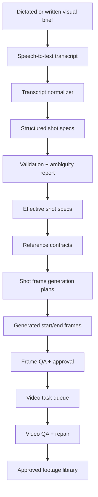

# Amira Automation Strategy Packet

Generated: 2026-04-26T18:33:42

## Purpose

This packet turns the Amira prompt-to-animated-footage strategy into repo-ready planning documents and a copy/paste implementation prompt for a coding agent.

The intended outcome is a local-folder-first automation pipeline:

## Contents

| File | Use |
|---|---|
| `01_NORTH_STAR_PIPELINE.md` | Ideal architecture and workflow design. |
| `02_CURRENT_STATE_AND_GAPS.md` | What exists, what is partial, what is missing. |
| `03_DATA_CONTRACTS.md` | JSON/Codable contracts for shot specs, references, frame plans, video tasks, QA. |
| `04_REFERENCE_MESH.md` | Automatic reference selection strategy and drift prevention. |
| `05_SHOT_FRAME_VIDEO_HANDOFF.md` | Generate-vs-edit frame rules, open-matte, Vidu handoff. |
| `06_AUTOMATION_API_CONTRACTS.md` | Loopback endpoints and command contracts for agents. |
| `07_QA_AND_REPAIR.md` | Frame/video QA checks, retry rules, manual escalation. |
| `08_IMPLEMENTATION_ROADMAP_AND_TASKS.md` | Phased roadmap and isolated coding tasks. |
| `09_ACCEPTANCE_TESTS.md` | Minimum test suite and validation checklist. |
| `10_AGENT_IMPLEMENTATION_PROMPT.md` | Long-form copy/paste prompt for the coding agent. |
| `AGENT_PROMPT_SHORT.txt` | Short copy/paste implementation prompt. |
| `IMPLEMENTATION_BACKLOG.json` | Machine-readable task backlog. |

## Non-negotiable rules

1. The app is local-folder-first.
2. Do not design around the deprecated Novotro Project Server.
3. Preserve manual intervention at every stage.
4. Favor dry-run/report-first workflows before paid image/video generation.
5. Never rely on the project title as visual shorthand.
6. Use `Places/places-world-context.json` as canonical for world period.
7. Ignore stale duplicates that describe the world as mid-2020s.
8. Store durable automation artifacts inside the live project.
9. Do not silently overwrite user text, approved references, generated frames, or video outputs.
10. Every paid generation job must produce sidecars and remain resumable.
